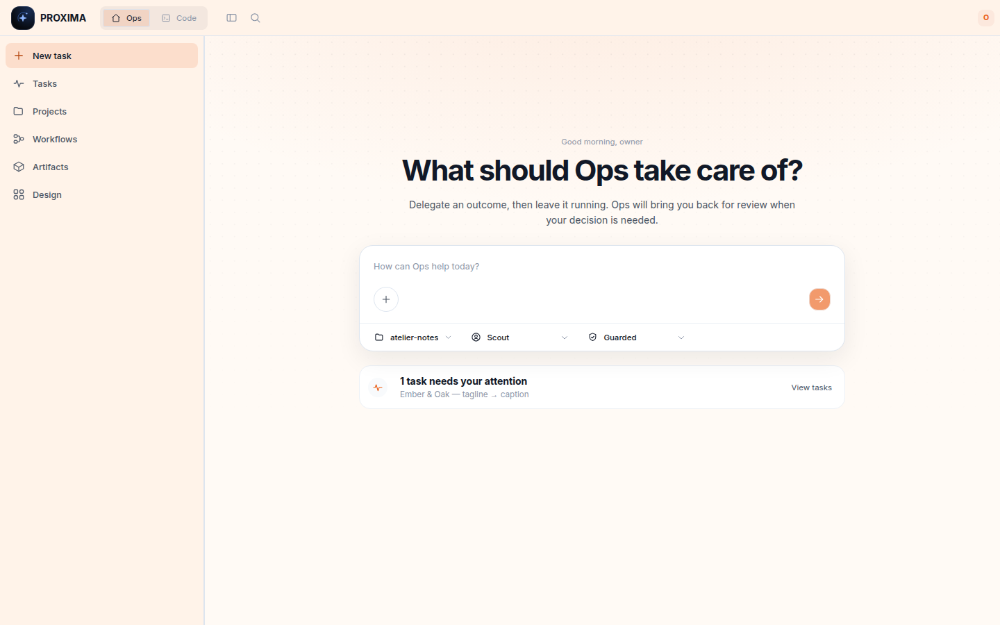
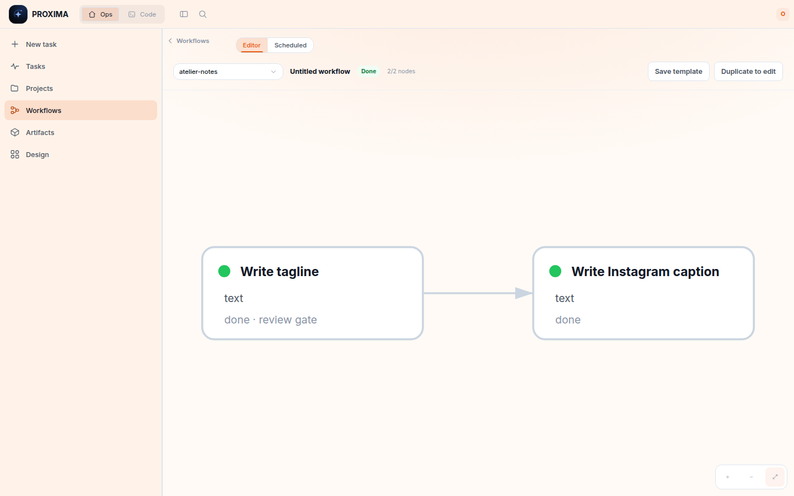
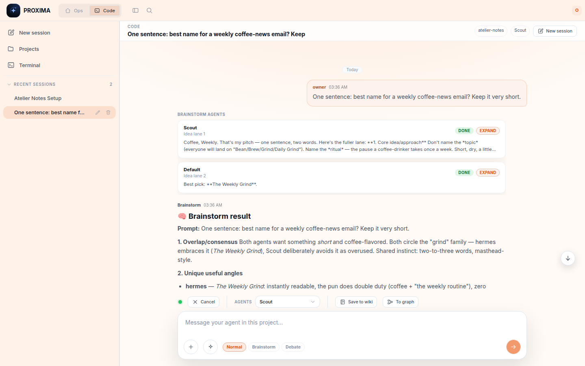

# Proxima

Your self-hosted **cockpit for the AI agents you already own** — delegate tasks,
chat, run reviewable workflow graphs on a schedule, and design, all in one private
control plane on **your own machine**. Bring your own agent CLI: **Claude Code,
Codex, Hermes, or Pi**. Reach it from any browser, or your phone via Tailscale.



## What it is

A workspace you self-host as a background service and open in a browser (or
install as a PWA on your phone). FastAPI backend + React PWA. It's a **control
plane**: it drives agents over the Agent Client Protocol (ACP), so you plug in
whichever agent CLI you already use and log into — Proxima ships **no model and
no credentials**. The work it orchestrates is domain-neutral: content, ops,
research, and code all flow through the same tasks, workflows, reviews, and
artifacts.

Two workspaces, one cockpit:

- **Ops** — delegate an outcome and review the result: task composer, durable
  jobs with review gates, workflow graphs, schedules, artifacts, Design Studio.
- **Code** — work alongside the agent: chat with tool approvals, multi-agent
  modes, and a real in-browser terminal.

## Features

- **Single-user cockpit** — set one owner password on first run, then use a
  persistent owner session. Run it for yourself, see your work organized, never
  lose context.
- **Ops tasks with review gates** — describe an outcome, pick an agent and a
  **Guarded** or **Autonomous** policy; the task runs as a durable job and
  pauses for your review before it counts as done.

  
- **Full-power chat** — streaming responses, tool-activity cards, slash
  commands, session continuity. Agent approval/permission prompts render as
  clickable cards; point the Claude Code runner at your live config and the
  agent inherits your real skills, plugins, rules, MCP servers, and memory.

  
- **Workflow graphs** — describe a process and an agent draws the DAG on an
  n8n-style canvas; nodes carry typed output contracts (`text` / `json` /
  `artifact-ref`), per-node agents, and review gates. Correct one node's output
  and every dependent node reruns deterministically. Promote a good chat into a
  graph with one click, save it as a template, run it on cron.

  
- **Multi-agent collaboration** — per-prompt **Brainstorm** (parallel idea
  lanes + synthesis) and **Debate** (alternating rounds + judge), plus a
  **Validate** sidecar where a different runner pressure-tests a finished
  answer and can replace it.

  
- **Design Studio** — the agent drafts **editable layered designs** (text stays
  real text) from a brief; refine them on a Konva canvas with a full inspector,
  selection-aware chat, per-project brand guide, and PNG/JPG/PDF/HTML export.

  
- **Image generation** — `/image` in chat via Codex/ChatGPT OAuth, xAI,
  Higgsfield, or any OpenAI-compatible endpoint; results land in Artifacts and
  can open in Design Studio.
- **Artifacts** — every project's outputs in one gallery (designs, images,
  documents, apps, data) with type-aware viewers and **Run & Preview** for dev
  servers behind a credential-stripping proxy.
- **In-browser terminal** — a real PTY shell scoped to the project. Work in the
  shell from anywhere, no SSH.
- **Link existing folders** — register any folder on disk as a project;
  chat/terminal/files operate on it. Removing a linked project only unlinks it.
- **Goal loop** — `/goal` keeps the agent iterating until done or blocked.
- **Wiki + knowledge** — per-project linked notes (`[[Note]]`) with an
  auto-updating graph; distill any chat into a wiki note.
- **Multi-runner profiles** — each agent profile picks a runner (Claude Code,
  Codex, Hermes, Pi) with an isolated credential home, its own instructions,
  and per-profile skills/MCP selection detected from your host.
- **Schedules** — five-field cron for saved workflow templates, with overlap
  policy and a "Run now" that exercises the real spawn path.
- **Self-update, audit log, themes & PWA** — one-click update from GitHub
  Releases, an audit trail of meaningful actions, six themes, installable on
  desktop or phone.

Video Studio and video generation were removed; ordinary video files still play
as generic artifacts.

**More screenshots:** [docs/tour.md](docs/tour.md) — a visual tour of every
surface.

## Requirements

- **Linux, macOS, or Windows** (no Docker required)
- [`uv`](https://docs.astral.sh/uv/) and Node.js / `npm`
- At least one **agent CLI** installed + logged in: Claude Code, Codex, Hermes, or Pi

See [docs/installation.md](docs/installation.md) for per-OS steps.

## Quickstart

```bash
git clone https://github.com/labsiqbal/proxima
cd proxima
bash scripts/install-user
```

Open `http://127.0.0.1:8765`.

Configuration (e.g. in `~/.config/proxima/proxima.env`):

```bash
export PROXIMA_SINGLE_USER_NAME=owner   # optional owner name used on first run
export PROXIMA_CLAUDE_LIVE_HOME=1       # claude-code runner uses your live ~/.claude
export PROXIMA_LINK_ROOTS="$HOME"       # roots you may browse + link folders from
export PROXIMA_FEATURE_DESIGN_STUDIO=1  # enable Design Studio (on by default in dev)
```

Manage the service:

```bash
systemctl --user status proxima
systemctl --user restart proxima
```

## Bring your own agent

Proxima ships **no credentials**. Each profile picks a runner (Claude Code, Codex,
Hermes, or Pi). Log into that agent's own CLI the way you normally would —
Proxima uses your existing login and **never asks for or stores provider passwords**.
With `PROXIMA_CLAUDE_LIVE_HOME=1`, the Claude Code runner points at your live
`~/.claude`, so all your installed skills, plugins, rules and MCP servers come along.

## Security / trust model

Proxima is a **single-user cockpit**. Keep the primary access gate at the network
layer (loopback, Tailnet, Cloudflare Access, or equivalent). On first run the owner
also sets a password; its session is defense-in-depth, not a multi-user permission
system. Agents run with the **same privileges as the server process** — they can
read/write files and run tools on the host.

Do **not** expose Proxima to untrusted users without a real external access gate
and OS/container isolation. See [docs/security-boundaries.md](docs/security-boundaries.md).

## Tailscale / phone access

```bash
sudo tailscale set --operator=$(whoami)   # one-time
sudo tailscale serve --bg 8765
```

Open your HTTPS MagicDNS URL on any device and install the PWA.

## Repository layout

```text
apps/api/        FastAPI backend (chat, runners/ACP, terminal, files, wiki, jobs)
apps/web/        React/Vite PWA
infra/scripts/   optional host/project helper scripts
infra/systemd/   service templates
docs/            architecture, install, security, backup docs
scripts/         build/dev/install/backup wrappers
templates/       project workspace templates
```

## Docs

**📖 [Documentation hub](docs/README.md)** — the single entry point to everything
(reference, guides, logs). Highlights:

- [Visual tour](docs/tour.md) — screenshots of every surface
- [Tech stack](docs/reference/tech-stack.md) · [Architecture & flows](docs/reference/architecture.md)
- [API reference](docs/reference/api.md) · [Database schema](docs/reference/database.md) _(both auto-generated from code)_
- [Capabilities / feature map](docs/CAPABILITIES.md)
- [Design Studio](docs/DESIGN-STUDIO.md)
- [Installation](docs/installation.md) · [Security boundaries](docs/security-boundaries.md) · [Backup & recovery](docs/backup.md)

## Contributing

Humans **and** AI agents are welcome. Proxima is *not meant to be "done"* — it evolves as the
agents it drives evolve. See [CONTRIBUTING.md](CONTRIBUTING.md) (DNA filter, the documentation
set, DCO sign-off — no CLA) and the [Architecture Decision Records](docs/adr/) for the *why*.

## License

[GNU AGPL-3.0-or-later](LICENSE). Proxima is a pure commons: you may self-host, modify, and
even run it as a service — but any derivative, **including a hosted/SaaS one**, must keep its
source open (AGPL §13). It cannot be closed or captured. Reasoning:
[ADR-0002](docs/adr/0002-license-agpl.md).
