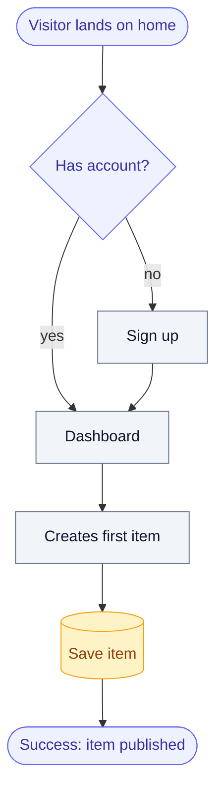
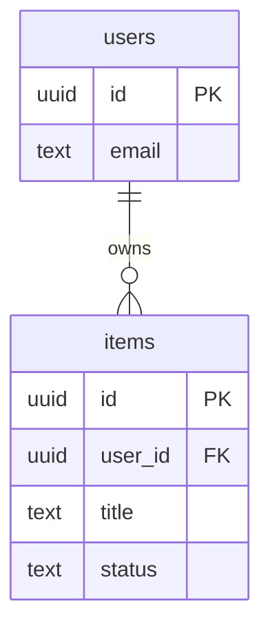
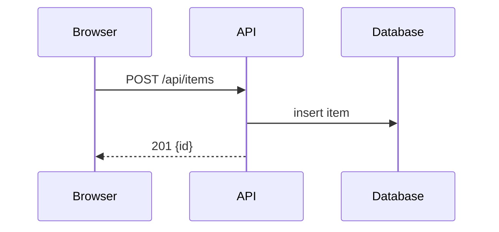
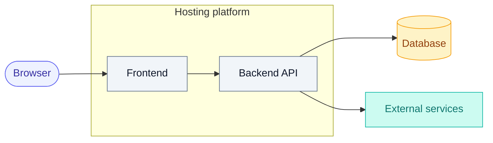
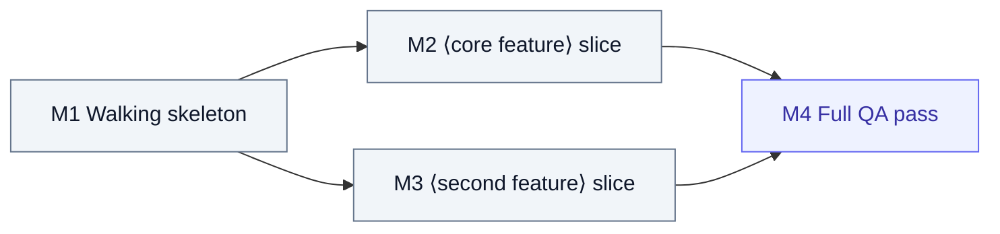

# masterplan.md Template

Copy this structure into the package's `masterplan.md` and fill every section. **Every section resolves to a DECISION with a short rationale. No option lists. No TBD.** If a section genuinely does not apply, keep the heading and write "Not applicable — ⟨reason⟩" so the executing agent knows it was considered, not forgotten. Scale depth to the project: a small tool gets short sections, a large app gets long ones.

**Decisions in prose, not artifacts that go stale.** Record decisions as prose and contracts, not brittle file paths or implementation snippets that rot the moment the executor names things differently. One deliberate exception: a snippet that *encodes a decision* — a state machine, reducer, schema, or type shape — may be inlined, trimmed to its decision-rich part (§7's schema is exactly this).

**Diagrams are first-class (so the package doubles as a presentation).** Any step or structure a reader would follow visually gets a **Mermaid** diagram, not just prose — lavish renders them and turns them into editable Excalidraw whiteboards during review, and the sources render natively on GitHub and most viewers (see `references/lavish-export.md`). The sections below marked **[diagram]** must carry one; add more wherever a flow, state machine, or relationship is easier seen than read: §5 user flows (`flowchart`), §7 data model (`erDiagram`), §8 multi-actor/async endpoints (`sequenceDiagram`), §11 architecture (`flowchart` with `subgraph`), §18 build order (`flowchart`). Apply the **colour-semantics classes** in every flowchart via `classDef` (entry = indigo, process = slate, datastore = amber, external = teal) so the same kind of node always reads the same; `erDiagram` and `sequenceDiagram` take no classes — their structure carries the semantics. Keep diagrams valid Mermaid — one that fails to parse renders blank in review: quote any label containing punctuation Mermaid parses (`m1["M1 (walking skeleton)"]`, `done(["Success: published"])`), and never name a node `end` (reserved word).

The `classDef` block every flowchart starts with:

```
classDef entry fill:#eef2ff,stroke:#6366f1,color:#3730a3
classDef proc fill:#f1f5f9,stroke:#64748b,color:#0f172a
classDef store fill:#fef3c7,stroke:#f59e0b,color:#92400e
classDef ext fill:#ccfbf1,stroke:#14b8a6,color:#0f766e
```

---

## 1. Summary & problem

What this product is, the problem it solves, and for whom — a half page maximum. The confirmed pitch paragraph from phase 1 belongs here, refined.

## 2. Prior-art & differentiation

The evidence that this should exist. Table plus the single most important sentence in the document:

| Product | What it does | What we absorb | License |
|---|---|---|---|
| ExampleApp | Link-in-bio pages with analytics | Page-builder flow, pricing model | Proprietary (pattern only) |
| example-oss | Self-hosted link pages | Data model, deploy setup | MIT |

**Absorption level (phase 2):** ⟨fork & adapt ⟨base repo⟩ / assemble (chimera) / differentiate / fresh⟩ — one line on why this rung.

**The one difference:** ⟨what makes this build distinct from the closest existing product — mandatory for "differentiate"; for the other rungs, what makes it yours⟩

## 3. Target users & business model

Who uses it (concrete persona, not "everyone"), how many at launch scale, and how it sustains itself: free / one-time / subscription / internal cost center. Include the owner's stated monthly budget for infrastructure and APIs — later sections must fit inside it.

## 4. Features

One block per feature. A feature without acceptance criteria does not exist.

### 4.1 ⟨Feature name⟩
**What it does:** one paragraph, concrete behavior.
**Priority:** core / secondary (core = the product is broken without it).
**Acceptance criteria:**
- [ ] ⟨observable, testable statement — "a visitor can submit the form and sees a confirmation within 2s"⟩
- [ ] ⟨…⟩

## 5. User flows **[diagram]**

One Mermaid `flowchart` per primary flow, plus a sentence naming its start and success end-state.



## 6. Pages & screens

Inventory of every page/screen with its components — the executing agent builds exactly this list.

| Page | Route | Components | Notes |
|---|---|---|---|
| Home | `/` | Hero, feature grid, CTA, footer | Public |
| Dashboard | `/app` | Nav, item list, create button, empty state | Auth required |

**Interaction baseline applies to every screen here.** The default states each page and control must handle — loading / empty / error / populated, and every interactive element's hover / focus / disabled / loading — are the standing standard in `references/ui-baseline.md`, copied into this package. Do **not** restate it per page; this section only records **additions or deliberate exceptions** for a specific screen (e.g. "this table also has a bulk-select toolbar state"). For a headless API/library/CLI project with no UI, write "No UI — interaction baseline N/A" and skip it.

## 7. Data model **[diagram]**

The actual schema, not "needs a database". Lead with a Mermaid `erDiagram` so relations read at a glance in the deck, then the exact schema below it:



Every table/collection, every field, every relation (`erDiagram` attributes are `type name` with an optional `PK` / `FK` marker — keep identifiers plain):

```sql
CREATE TABLE users (
    id          UUID PRIMARY KEY DEFAULT gen_random_uuid(),
    email       TEXT UNIQUE NOT NULL,
    created_at  TIMESTAMPTZ NOT NULL DEFAULT now()
);

CREATE TABLE items (
    id          UUID PRIMARY KEY DEFAULT gen_random_uuid(),
    user_id     UUID NOT NULL REFERENCES users(id) ON DELETE CASCADE,
    title       TEXT NOT NULL,
    status      TEXT NOT NULL DEFAULT 'draft' CHECK (status IN ('draft','published')),
    created_at  TIMESTAMPTZ NOT NULL DEFAULT now()
);
```

If the product has no persistent data, state that and why.

## 8. API contracts

Internal endpoints the frontend consumes — route, payload, response, error shape. For any endpoint that is **multi-actor or async** (webhook, background job, third-party callback, streaming), add a Mermaid `sequenceDiagram` showing who calls whom in what order — these are the flows a walkthrough audience most needs to see:



The endpoint list — route, payload, response, error shape:

```
POST /api/items
Request:  { "title": "My first item" }
Response: 201 { "id": "…", "title": "My first item", "status": "draft" }
Errors:   401 unauthenticated · 422 { "error": "title required" }
```

## 9. External integrations & AI roles

Every third-party service and what it does here. Each entry verified alive during phase 4, with pricing at the expected volume:

| Service | Role | Plan/tier | Est. monthly cost | Verified on |
|---|---|---|---|---|
| ⟨payment provider⟩ | Checkout | Standard, 2.9% + fee | ~⟨amount⟩ | ⟨date⟩ |
| ⟨LLM API⟩ | Generates descriptions | Pay-as-you-go | ~⟨amount⟩ | ⟨date⟩ |

If AI is part of the product, specify exactly where it acts, which model tier, and the fallback when it fails.

## 10. Tech stack

The chosen stack — one choice per layer, with rationale tied to sections 3 and 9:

| Layer | Choice | Why |
|---|---|---|
| Frontend | ⟨framework⟩ | ⟨reason⟩ |
| Backend | ⟨framework/runtime⟩ | ⟨reason⟩ |
| Database | ⟨engine⟩ | ⟨reason⟩ |
| Hosting | ⟨platform⟩ | ⟨reason — must fit §3 budget⟩ |

One stack, already decided: the phase-4 comparison (2–3 options, owner ratified) happened in the decision process, not here. Runner-up stacks and why they lost go to §20 so the executor doesn't second-guess this table.

## 11. Architecture **[diagram]**

How the pieces connect — a short prose description plus a diagram. Use a `flowchart` with `subgraph` containers to show what runs where:



Name the boundaries: what runs where, what talks to what, what is stateless.

## 12. Security

Concrete requirements, scaled to the product's fate (§21): auth mechanism, session/token handling, input validation strategy, secrets handling (env vars, never committed), rate limiting if public, data privacy obligations if user data is stored.

## 13. Deployment & infrastructure

Where it runs, how it ships, and what it costs: hosting target, deploy method (the executing agent must be able to perform it), domain/TLS, backups if there is a database, and the monthly total — which must fit the §3 budget.

## 14. Component reference map

The chimera map: each major component anchored to a proven implementation. Pattern = re-derive the approach; code = adapt with attribution (license permitting).

| Component | Reference (repo/product) | License | Absorb |
|---|---|---|---|
| ⟨e.g. drag-drop editor⟩ | ⟨repo URL⟩ | MIT | Code — adapt directly |
| ⟨e.g. onboarding flow⟩ | ⟨product⟩ | Proprietary | Pattern only |

Quality bar for what's worth anchoring to: prefer simple, deep interfaces — small surface, complexity hidden — for long-term maintainability.

## 15. Design direction

Prevents functionally-correct-but-generic output:

- **Register:** brand (expressive, marketing) or product (calm, workhorse UI) — pick per surface.
- **Mood:** 3–5 words ("warm, editorial, unhurried").
- **Look references:** 2–3 existing products whose visual quality is the bar.
- **Must NOT look like:** ⟨the failure mode — e.g. "a default component-library dashboard with stock gradients"⟩.
- **Industry UX conventions (from phase-2 research):** the table-stakes patterns this product's *category* expects, cited from the deep-dive — "products X and Y in this space all do ⟨pattern⟩, so we adopt it" (e.g. fintech → transaction confirmations + audit trail; SaaS dashboard → filters/saved views/bulk actions; consumer → onboarding coach + rich empty states). List which the build adopts and any it deliberately drops (→ §20). This is the layer *above* the universal `references/ui-baseline.md` floor — it makes the product feel native to its industry, not just generically correct.

This section covers **taste** (what it should feel like). The **mechanics** — interaction states, empty/error handling, keyboard, responsive, motion — are the non-negotiable floor in `references/ui-baseline.md` and are not re-decided here. Design direction sets the bar *above* that floor. EXECUTE.md's design-stack rule tells the executing agent which design skills to engage to hit this bar — this section is enforced at build time, not advisory. It also drives the look of the lavish-exported artifact (`references/lavish-export.md`), so the deck previews the product faithfully.

## 16. Content & seed data

What the product contains on day one so it ships alive, not as an empty shell: what content, from where (AI-generated / owner-provided / imported), and minimum quantities ("20 seeded articles", "5 example projects"). If the executing agent generates it, say so and set the quality bar.

## 17. Required credentials

Everything the owner must provide, and when the build needs it:

| Credential | Used by | Needed at milestone |
|---|---|---|
| ⟨API key⟩ | §9 integration | M4 — integrations |
| ⟨hosting token⟩ | §13 deploy | M7 — deploy |

## 18. Build order **[diagram]**

The sequence STATUS.md mirrors — numbered milestones ending with the full QA pass. Milestones are **tracer bullets**: after the walking skeleton, each one is a COMPLETE vertical slice through every layer (UI → API → data), demoable on its own — never a horizontal layer that only pays off later. Size each slice to **one agent context window**: a milestone too big to finish in one session is two milestones. Lead with a Mermaid `flowchart` of the **blocking edges** — which slice unblocks which — so the plan is legible in one glance and independent slices are visibly parallelizable:



1. **M1 — Walking skeleton:** the thinnest end-to-end slice — one page, one API call, one row in the database, runnable locally. Every later slice hangs off it.
2. **M2 — ⟨core feature⟩ slice:** the feature complete through every layer, demoable alone, its §4 acceptance criteria and behaviour-level tests passing.
3. **M⟨n⟩ — …** (one vertical slice each; dependencies exactly as the blocking-edge diagram shows)
4. **M⟨last⟩ — Full QA pass:** every acceptance criterion in §4 verified with evidence, the testing strategy's required coverage green, **and** the interaction baseline in `references/ui-baseline.md` walked and confirmed on the primary flows (its own verification checklist) — for any project with a UI.

**Testing strategy (decided in phase 4):** tests target **external behaviour at acceptance level** — what the product does, never how it is implemented — so they survive refactors. Each feature slice lands with the tests for its §4 acceptance criteria; state here anything beyond those that must be covered (e.g. the primary flows end-to-end).

## 19. Non-goals

What is deliberately NOT built, so the executing agent doesn't helpfully add it: ⟨e.g. "no mobile app; no multi-language; no admin panel in v1"⟩.

## 20. Considered and rejected

Deliberate choices that might look like mistakes — from validation and interrogation — so nobody "fixes" them:

| Suggestion | Source | Why rejected |
|---|---|---|
| ⟨e.g. use a CMS⟩ | Validation 🟡 | ⟨reason⟩ |

## 21. Product fate

Open source / commercial / internal — and what that implies here: license choice, README/docs expectations, hardening level, telemetry stance.

## 22. Version & changelog

Maintained by revise mode. Bump minor for additive changes, major for changes to already-built behavior.

- **v1.0 — ⟨YYYY-MM-DD⟩ — initial**
