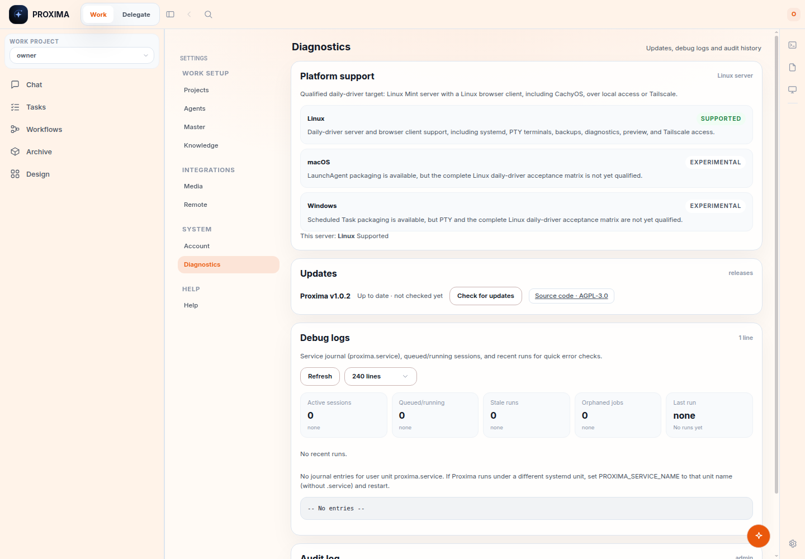

# Linux Daily-Driver Browser Evidence

Captured on 2026-07-31 from a disposable loopback server rooted at a temporary
HOME, database, workspace, runner-home, browser profile, and cache. The server
fixture had Master enabled, the worker disabled,
release checks disabled, and preview relays disabled. No installed service,
database, Tailscale state, privileged enrollment, signing material, or release
custody was used.

## Evidence



The raw Chrome DevTools Protocol capture is a 1440x1000 PNG at the exact path
`docs/evidence/linux-daily-driver/diagnostics-platform-support.png`.
`Page.captureScreenshot` produced 177,664 bytes. The capture script writes the PNG
with mode `0644` at capture time; checked-out mode may follow the local umask.
Independent verification checked:

- PNG signature `89504e470d0a1a0a`
- nonzero IHDR dimensions `1440x1000`
- regular file size `177664`
- exact resolved output path
- no real-browser console errors

The same browser pass asserted:

- Linux is labeled `Supported`
- macOS and Windows are labeled `Experimental`
- the Linux Mint server, CachyOS client, and Tailscale target copy is visible
- the detected server catalog is `linux` / `supported`
- the Master Settings entry is visible

## Reproduce against an isolated server

Start an isolated server with its paths beneath a temporary fixture root, then run:

```bash
PROXIMA_BROWSER_FIXTURE_ROOT=/tmp/<isolated-fixture> \
PROXIMA_EVIDENCE_PASSWORD='<fixture password>' \
node scripts/capture-linux-daily-driver-evidence.mjs \
  http://127.0.0.1:<fixture-port> \
  "$PWD/docs/evidence/linux-daily-driver/diagnostics-platform-support.png"
```

The capture script refuses non-loopback targets, fixture roots outside the system
temporary directory, and output paths outside this evidence directory. It writes
the decoded PNG bytes directly after completing the real-browser assertions, then
verifies the signature, dimensions, exact path, and stat before reporting success.
