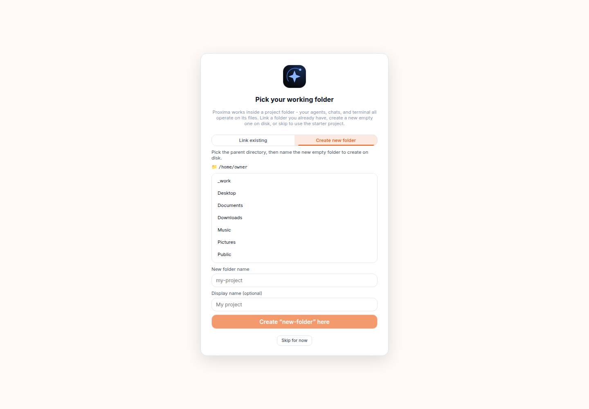

# Visual tour

This is Proxima as it ships now: a single-user, self-hosted control plane for
hands-on agent work and delegated agent teams. Every screenshot on this page was
captured on 2026-07-24 in one uniform pass on branch
`fm/proxima-screenshot-uniform-refresh` (HEAD of main after #37 Alpha UI parity
and destinations-only nav). Capture used a disposable owner DB and isolated
`scripts/dev`-style API + Vite on loopback at a fixed viewport of **1440×1000**,
sidebar expanded, Light theme, starter project after onboarding **Skip**.

All primary tour shots share the same Deck chrome: destinations-only left nav
(Chat, Alpha, Tasks, Recipes, Projects, Archive, Design), shared main-pane
ambience, and tool rails on the right. Older multi-era PNGs were deleted and
replaced; none of the files below mix pre-parity Alpha skin with current Deck.

Feature details live in [CAPABILITIES.md](CAPABILITIES.md). This page focuses on
what an owner sees and how the surfaces connect.

## Live-pass matrix

| Surface | Result | Screenshot |
| --- | --- | --- |
| First-run password | pass | `first-run-password.png` |
| Onboarding Link tab | pass (folder names redacted where personal) | `onboarding-link-folder.png` |
| Onboarding Create tab | pass | `onboarding-create-folder.png` |
| Core tour (4 steps) | pass | `core-tour-*.png` |
| Chat empty default | pass - no primary-nav New chat; header New chat kept | `deck-chat.png` |
| Chat send / approvals / restore | skip - no live agent turn in this pass | - |
| Alpha empty + Grok backing | pass - Deck chrome parity | `alpha-desk.png` |
| Alpha runner picker (Grok listed) | pass | `grok-runner-picker.png` |
| Alpha populated / checkpoint restore | skip - no worker jobs in this pass | - |
| Attention inbox (empty) | pass | `attention-inbox.png` |
| Tasks list / board / New task | pass (empty project honest) | `tasks-*.png`, `task-launcher.png` |
| Recipes home / editor / schedules | pass | `workflows-home.png`, `workflow-blank-canvas.png`, `schedules.png` |
| Projects | pass | `projects.png` |
| Archive registry | pass (empty) | `archive-registry.png` |
| ArtifactViewer v2 deep review | skip - no live artifacts this pass | - |
| Design home | pass | `design-home.png` |
| Design studio canvas | skip - not opened beyond home | - |
| Terminal / Files / Preview rails | pass | `terminal.png`, `files.png`, `preview-rail.png` |
| Search | pass | `search.png` |
| Settings (appearance, Alpha, agents, diagnostics) | pass | `settings-*.png` |
| Help & Tours / Core flow chapter | pass | `help-tours.png`, `help-core-flow.png` |
| Agents profiles | pass | `agents-profiles.png` |
| Skills & MCP / bundled masterplan | pass | `skills-mcp.png`, `bundled-masterplan-skill.png` |
| Wiki under Settings | pass | `wiki.png` |
| Mobile shell | skip - tour does not claim mobile shots | - |

## 1. The workspace

The shell keeps primary destinations on the left, the current surface in the
center, and technical tools on the right. Left nav is **destinations only**:
Chat, Alpha, Tasks, Recipes, Projects, Archive, and feature-gated Design. There
is no primary-nav **New chat** row - a blank session starts from the Chat header
control, the mobile topbar icon, or `/new`.

The first post-setup visit offers a four-step core tour. It explains the two ways
to work, hands-on Chat, delegated Alpha work, and the Tasks plus Attention review
loop. The same tour can be replayed later from Settings → Help & Tours.

## 2. First run

A new install sets one owner password. Proxima is still a single-user tool: the
password is defense in depth behind the owner's loopback, Tailnet, or other
network boundary, not a multi-tenant account system.

The optional folder step can **Link** an existing workspace, **Create new folder**,
or **Skip for now** to use the starter project. This pass captured both Link and
Create tabs, then used Skip for the rest of the tour.

## 3. Chat: hands-on work

Chat is the direct path. An empty Chat is the default blank composer - no session
until the first send. Pick an agent, type a prompt or `/` for commands, and use
the header **New chat** action when you want another blank thread.

**Honest boundary:** live agent send, tool approval cards, turn restore, slash
masterplan intake, and `@` artifact mentions were not re-driven in this chrome
refresh pass. Those flows remain shipped; they are not pictured here as fresh
evidence.

## 4. Alpha: delegate and monitor

Alpha is a navigation peer to Chat. Its desk reuses Deck chrome: shared main-pane
ambience, `code-header` style bar, Settings-sized toggle and select, ghost-button
examples, and surface cards without a separate marketing page skin.

This pass selected **Grok** as the backing runner (host reported it ready) and
captured the honest empty desk: capacity 0/3 free, unattended off, empty queue,
empty Attention, empty checkpoints.

The profile runner picker lists every installed runner, including Grok.

Unattended budgets remain under Settings → Alpha.

## 5. Attention and Tasks

The shell Attention badge opens a global inbox. With no blocked work it states
that nothing needs you.

Tasks is the durable execution and review index. An empty project is shown
honestly.

**New task** opens a focused launcher with Project, Agent, and Guarded or
Autonomous policy.

## 6. Recipes and scheduled plans

Recipes is the repeatable-work layer.

The editor opens a blank plan canvas with trigger and first step.

Scheduled Recipes use five-field cron and an enabled toggle. Empty state is
honest when no Recipe is saved yet.

## 7. Archive and Projects

Archive remembers deliverables as durable records. Empty registry:

Projects is a card grid around the active work container.

## 8. Tool rail

Terminal, Files, and Preview are tools, not destinations. They open over the
current surface and remain scoped to the active project.

Global search covers user-facing chats, messages, projects, and designs.

## 9. Design Studio

Design is present only when its server-owned feature flag is on. The home accepts
a brief, format, brand guide, or size template.

## 10. Agents, knowledge, settings, and help

Agent profiles choose a ready runner, isolated home, instructions, and detected
skills or MCP servers.

Knowledge and Wiki stays under Settings rather than adding another primary
destination.

Help and Tours provides the replayable core tour plus feature-aware chapters.

Account preferences include themes, font choice, and font-size scaling.
Diagnostics keeps update checks, debug logs, and the owner audit trail.

## Live-pass notes

- **Chrome standard:** 1440×1000, Light theme, expanded sidebar, destinations-only
  left nav, post-#37 Deck shell on every primary shot. No mix of old solid Alpha
  marketing empty state with current Alpha desk.
- **Passed:** first-run password, onboarding Link + Create tabs, core tour (4
  steps), empty Chat, Alpha desk with Grok + open runner picker, Attention,
  Tasks list/board/launcher, Recipes home/editor/schedules, Projects, Archive
  empty registry, Design home, tool rails, Search, Settings sections, Agents
  profiles, Skills/MCP + masterplan, Wiki, Help.
- **Skipped (honest):** live Chat agent turns, approvals, turn restore,
  masterplan intake UI in Chat, `@` mentions, Alpha worker dispatch and
  checkpoint restore, populated Tasks review, ArtifactViewer v2 deep review,
  Design studio canvas beyond home, mobile shell. Those surfaces still ship;
  this pass prioritized shell/nav uniformity over multi-minute agent runs.
- **Redaction:** personal host paths and usernames in folder pickers and agent
  home lines were neutralized to `/home/owner/…` style placeholders before
  capture where needed.
