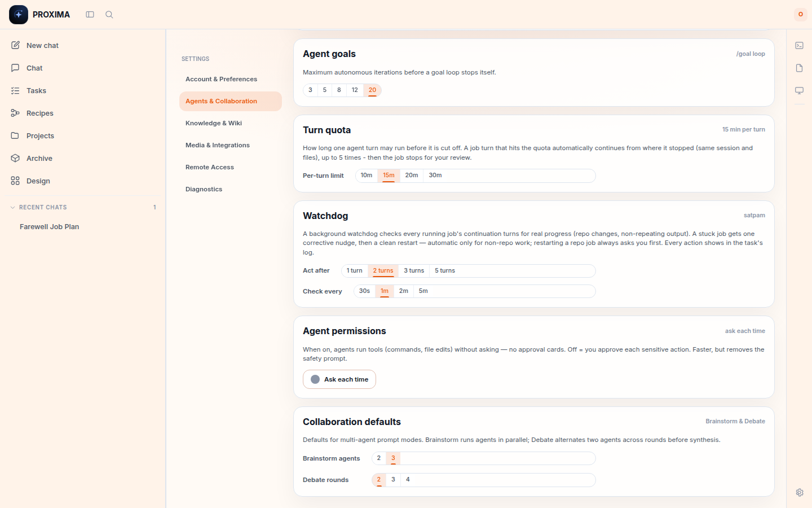

# Visual tour

Every major surface of Proxima, captured from a real instance (default *Sunset*
theme). Feature descriptions live in [CAPABILITIES.md](CAPABILITIES.md); this page
is the "what does it look like" layer. Captures dated 2026-07-22 were taken by
driving the shipped Phase-1 build end-to-end; a few older captures of unchanged
surfaces remain and are marked where they appear.

## The workspace

One workspace, one flow: **Chat / Tasks / Recipes / Projects / Archive / Design**
in the left nav, the work in the center, and the technical tools (Terminal, Files,
Preview, Settings) as a right icon rail - available one click away in any context.

## First run

Set the owner password, then optionally link a real folder as your first project.

## Chat — the front door

Chat with streaming, tool-activity cards, and interactive approval cards
(auto-approve is an explicit Settings opt-in). Think it through until the scope is
clear, then **Slice into plan** turns the conversation into runnable jobs.

Below: a real agent turn - tool activity (search, reads, terminal), a live
**approval card** for a file edit, and the **Slice into plan** button:

**Brainstorm** fans a prompt out to parallel agent lanes and synthesizes;
**Debate** alternates rounds before a judge pass:

**Validate** asks a *different* agent to pressure-test a finished answer — with
a structured verdict, gaps/risks, and a revised version you can apply:

`/image` generates images through your configured provider; results are saved
as project artifacts and can open in Design Studio:

## Tasks

Tasks lists plans and one-off jobs together. **+ New task** opens the launcher:
describe an outcome, pick project + agent + execution policy
(Guarded / Autonomous), and go. Tasks needing your attention surface right below.

A **Guarded** task pauses at a review gate — the output is editable before you
approve it as done. Artifacts produced by the task are linked as chips.

A job aimed at a repo runs in an **isolated copy of the code** and comes back as
a diff. The plan row expands in place: per-file changes, the target badge
(`demo-app`), and the two verdict doors — **Approve & merge changes** lands a
local `--no-ff` merge; **Reject…** records a reason and discards the copy.

## Recipes

The Recipes home: describe a process and the agent draws the plan, or start
from a blank canvas. Drafts, saved Recipes, and run history live here.

**Slice into plan** lands here too: the architect turns a chat into a frozen,
editable draft — each job tagged with its one target (`repo demo-app` on the
node below). Review or edit, then **Approve plan & start**:

Each node has an inspector: instruction, expected output, rules, its own agent,
a typed output contract (`text` / `json` / `artifact-ref`), a review-gate
checkbox, and dependency checkboxes.

A running graph pauses at node review gates. You can **correct the output** (all
transitive descendants are marked stale and rerun) or rerun the node itself:

A plan node can be a **script step** (*"no AI involved"*): it runs a saved
script from the project's `scripts/` folder. The first run pauses for a
one-time, hash-bound approval - the card shows the script's **exact content and
sha256**, and approving trusts those bytes until the file changes again:

**Schedules** run saved Recipes on five-field cron, with overlap policy and a
"Run now" that uses the real scheduler spawn path:

## Tool rail — Terminal, Files, Preview

Terminal, Files, and Preview open from the right icon rail as overlay panels, in
any context, scoped to the active project. A real PTY terminal (shells survive
closing the panel):

Global search covers chats, messages, projects, and designs:

## Design Studio

The Design home takes a brief (Graphic / Slide deck / Mobile app / Website) or a
size template, and can generate a per-project brand guide from reference URLs
and images:

The agent replies with an editable layered scene that the canvas applies live —
text stays text, shapes stay shapes. Below: a design generated from a one-line
brief, with the selection-aware chat on the left and the artboard inspector
(gradient background, size, presets) on the right:

Select any layer for direct manipulation with a full inspector; the studio chat
is selection-aware. Export as PNG/JPG/PDF/HTML.

## Archive

The durable deliverable registry (T4): every agent output becomes a record with
lineage (chat → task → file), one approval status (draft / in review / approved /
superseded), and a version chain. Filter by project, type, status, and date;
records survive file moves and deletion.

A row expands in place for a quick scan; "Open full record" goes to the record's
permanent address (`#archive/<project>/<slug>`) with a large preview, the
approve/status actions ("one truth, two doors" - approving here and approving
the task in its review write the same status), version history, and the lineage
chain as links:

Type-aware viewers open the underlying file:

**Run & Preview** launches a project app (owner-confirmed) and previews it
behind a credential-stripping proxy:

## Projects, agents, settings

A project is a **work container**: git-repo subfolders are auto-detected as code
areas (with manual override), and the container settings pair each code area
with its detected remote. An area with a remote gets the **push after merge**
toggle - default off, BYO `git`, no stored credentials:

Agent profiles: per-profile runner, isolated credential home, instructions, and
skills/MCP selection detected from the runner's own host config:

Settings → Agents & Collaboration holds the run controls in one place: the
**turn quota** (default 15 min per turn, auto-continue up to 5 genuine resumes,
then an honest stop), the **watchdog** (*satpam*) cadence, and the global
**agent permissions** toggle (ask each time vs auto-approve):

Wiki notes with `[[links]]`, backlinks, and a graph view live under Settings →
Knowledge & Wiki:

Appearance (six themes, font + size), and Diagnostics (updates / debug logs /
audit log):

