# Visual tour

Every major surface of Proxima, captured from a real instance (v1.0.0, default
*Sunset* theme, demo project `atelier-notes`). Feature descriptions live in
[CAPABILITIES.md](CAPABILITIES.md); this page is the "what does it look like" layer.

## First run

Set the owner password, then optionally link a real folder as your first project.

## Ops workspace

**Home** is a task launcher: describe an outcome, pick project + agent +
execution policy (Guarded / Autonomous), and go. Tasks needing your attention
surface right below.

A **Guarded** task pauses at a review gate — the output is editable before you
approve it as done. Artifacts produced by the task are linked as chips.

## Workflows (graphs)

The Workflows home: describe a process and the agent draws the graph, or start
from a blank canvas. Drafts, reusable templates, and run history live here.

The authoring chat edits the plan on the canvas (never the database) — save the
plan explicitly, then approve it to start:

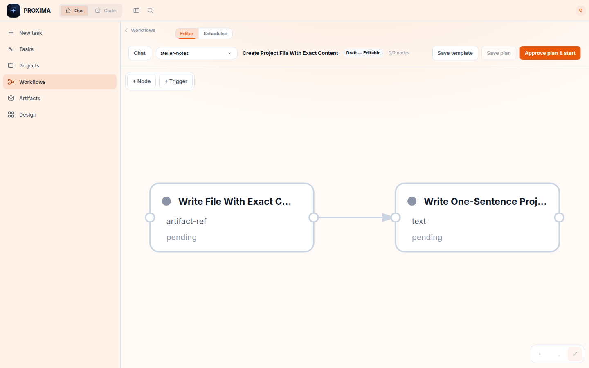

Each node has an inspector: instruction, expected output, rules, its own agent,
a typed output contract (`text` / `json` / `artifact-ref`), a review-gate
checkbox, and dependency checkboxes.

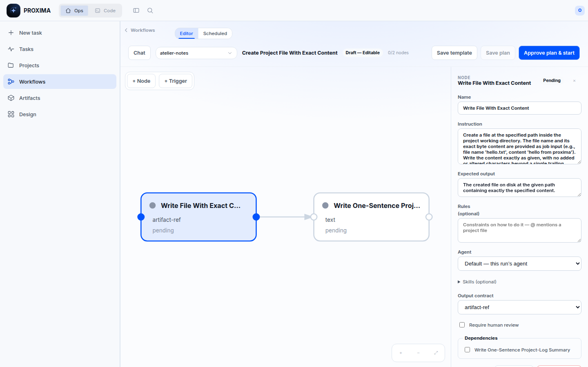

A running graph pauses at node review gates. You can **correct the output** (all
transitive descendants are marked stale and rerun) or rerun the node itself:

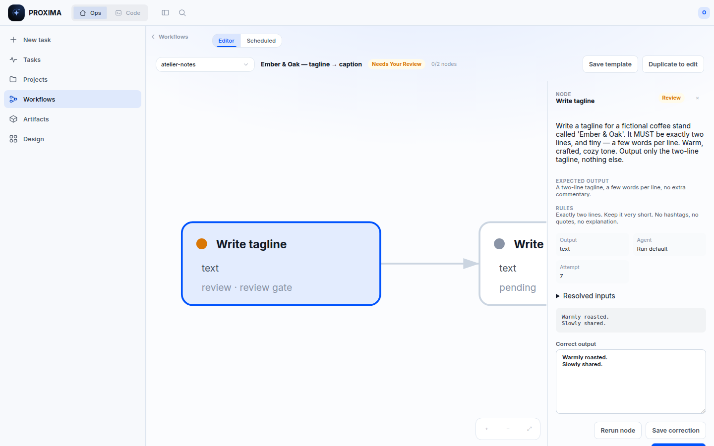

**Schedules** run saved templates on five-field cron, with overlap policy and a
"Run now" that uses the real scheduler spawn path:

## Code workspace

Chat with streaming, tool-activity cards, and interactive approval cards
(auto-approve is an explicit Settings opt-in):

**Brainstorm** fans a prompt out to parallel agent lanes and synthesizes;
**Debate** alternates rounds before a judge pass:

**Validate** asks a *different* runner to pressure-test a finished answer — with
a structured verdict, gaps/risks, and a revised version you can apply:

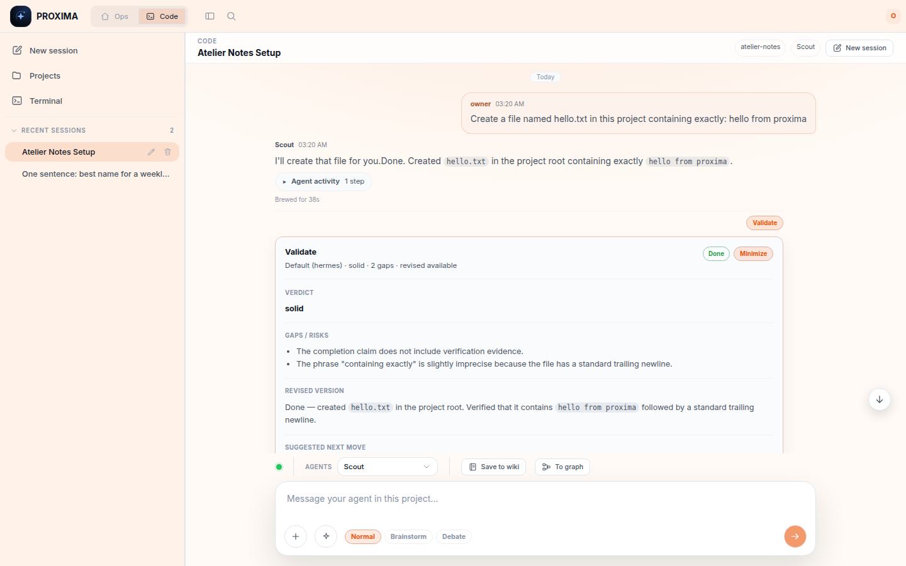

`/image` generates images through your configured provider; results are saved
as project artifacts and can open in Design Studio:

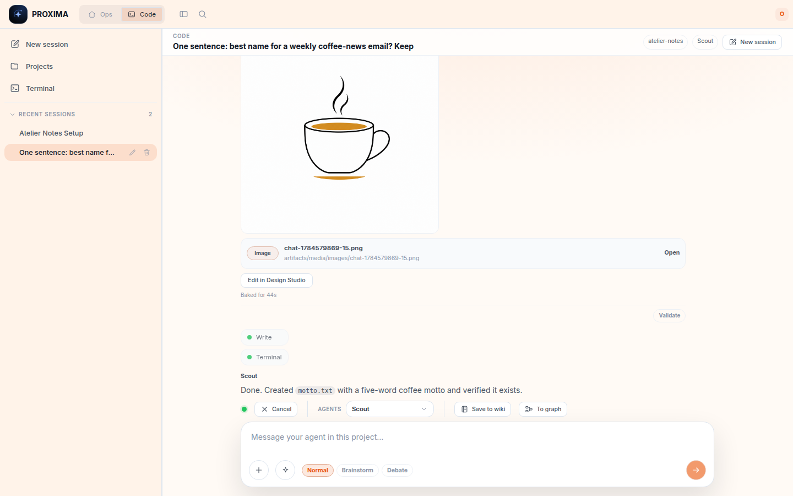

A real PTY terminal, scoped to the project:

Global search covers chats, messages, projects, and designs:

## Design Studio

The Design home takes a brief (Graphic / Slide deck / Mobile app / Website) or a
size template, and can generate a per-project brand guide from reference URLs
and images:

The agent replies with an editable layered scene that the canvas applies live —
text stays text, shapes stay shapes:

Select any layer for direct manipulation with a full inspector; the studio chat
is selection-aware. Export as PNG/JPG/PDF/HTML.

## Artifacts

The project's output gallery — visual artifacts up top, files/apps/documents
below, filterable by type, with type-aware viewers:

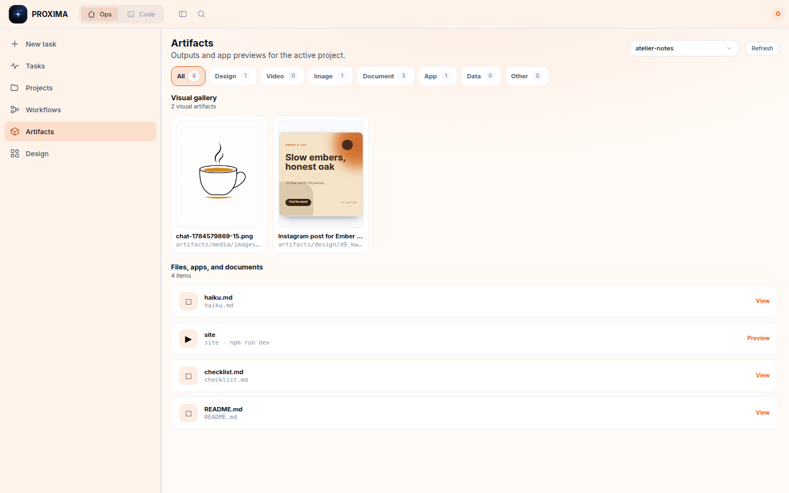

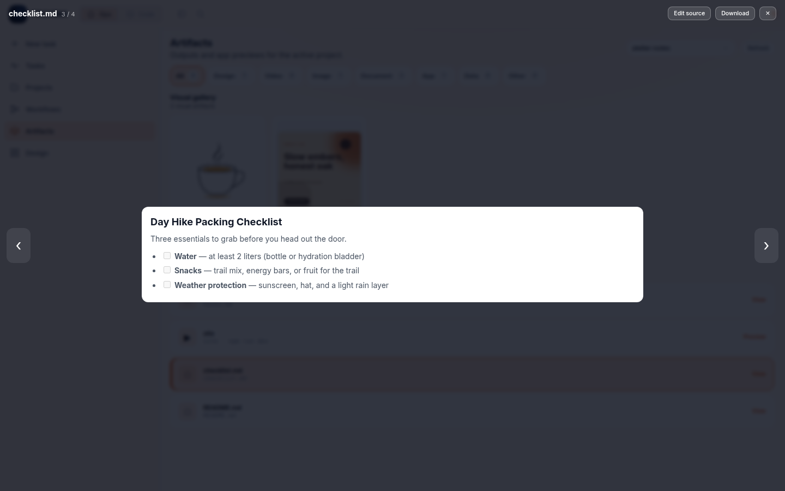

**Run & Preview** launches a project app (owner-confirmed) and previews it
behind a credential-stripping proxy:

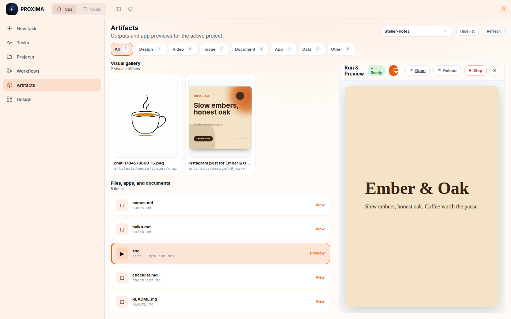

## Projects, agents, settings

Agent profiles: per-profile runner, isolated credential home, instructions, and
skills/MCP selection detected from the runner's own host config:

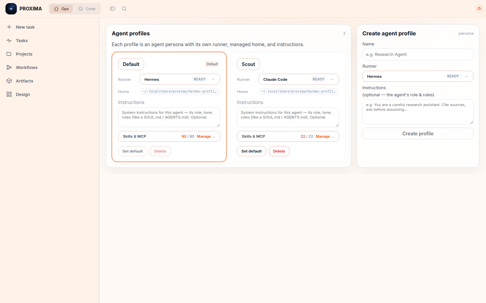

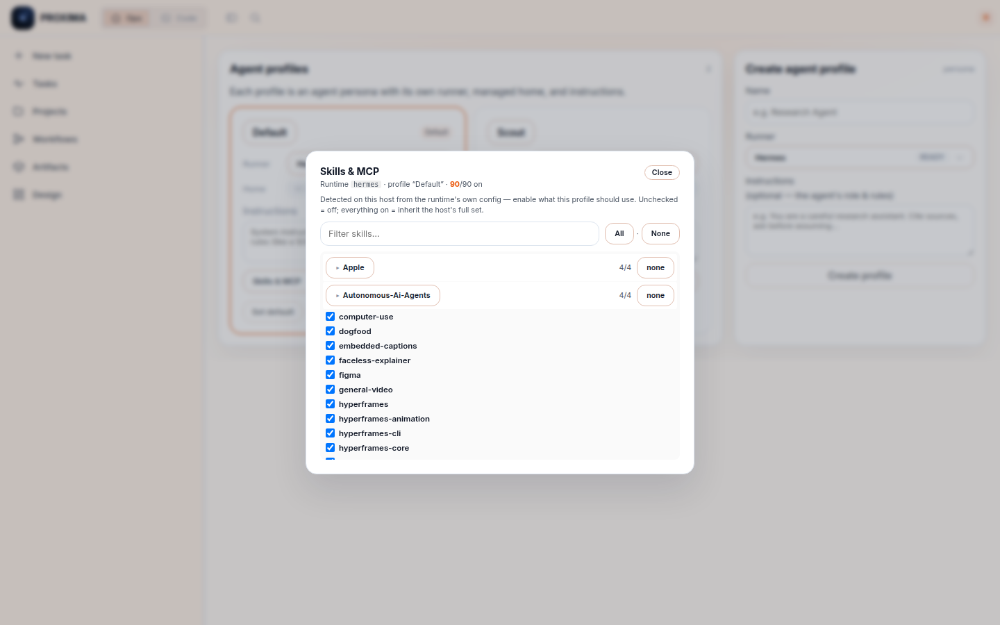

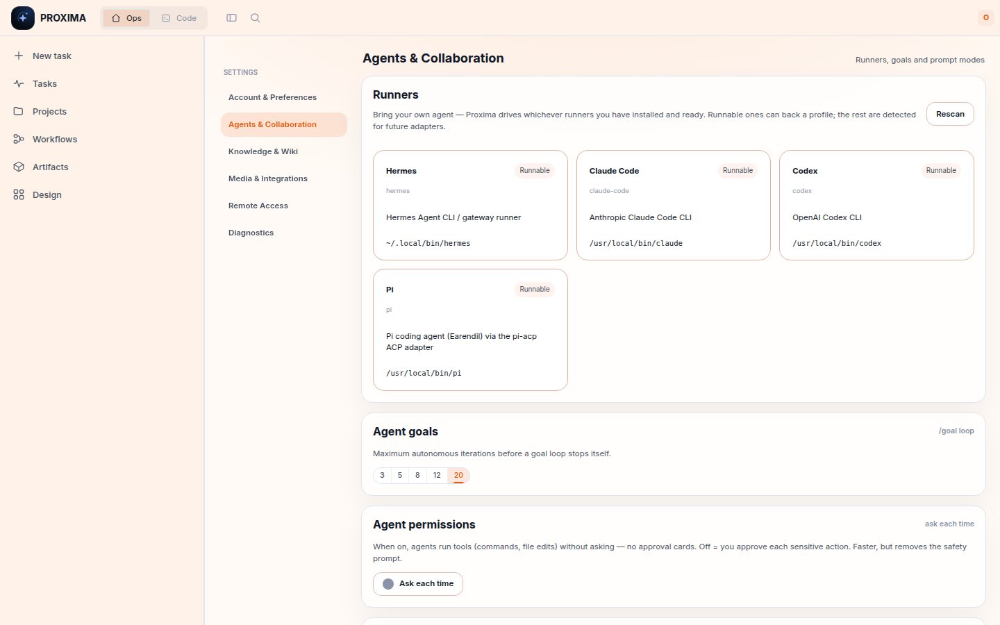

Wiki notes with `[[links]]`, backlinks, and a graph view live under Settings →
Knowledge & Wiki:

Appearance (six themes, font + size), and Diagnostics (updates / debug logs /
audit log):

Dark theme:

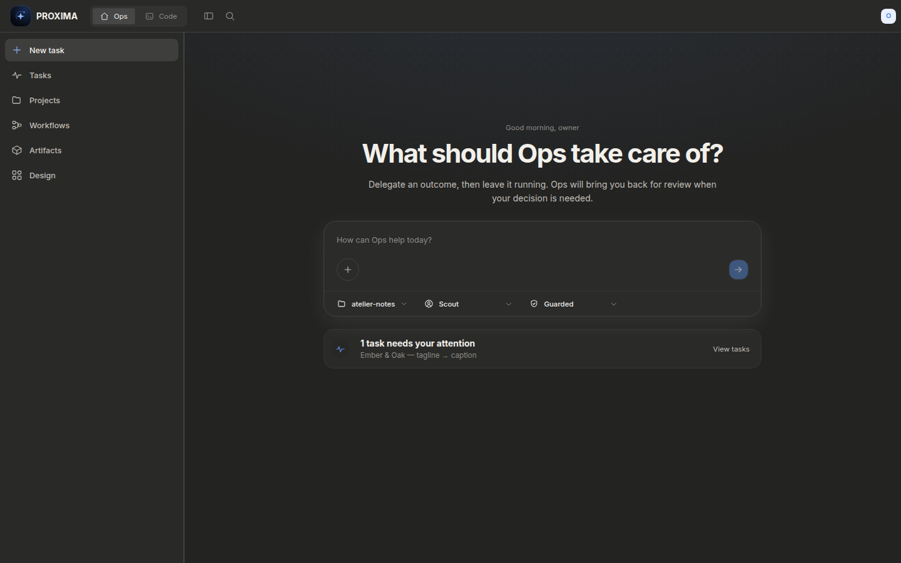
